# Family Game Room

<p align="center">
  <strong>A 19-game browser-based family game platform spanning cards, boards, cooperative RPG play, local arcade play, and phone-controlled party games.</strong>
</p>

<p align="center">
  <a href="https://github.com/grumpystrongman/familycanasta/actions/workflows/validate.yml"></a>
  
  
  
  
</p>

<p align="center">
  <a href="https://family-canasta-ce7d2.web.app">Hosted application</a>
  ·
  <a href="#pixelquest-the-living-dungeon">PixelQuest</a>
  ·
  <a href="#game-catalog">Game catalog</a>
  ·
  <a href="#testing">Testing</a>
  ·
  <a href="#local-development">Local development</a>
</p>

Family Game Room started as a complete online Canasta table and has grown into a shared game-night platform. Each game keeps its own rules engine and presentation while sharing a central hub, browser deployment, responsive layout infrastructure, Firebase room services where appropriate, and automated validation.

The platform now includes **19 playable games**:

- 9 traditional and family card games.
- 5 strategy / tabletop games.
- 1 cooperative online fantasy RPG.
- 1 local physics arcade game.
- 3 TV-and-phone Party Stage games.

> **Product posture:** Family Game Room is designed for trusted family and friend groups, demonstrations, and controlled beta use. It is not currently positioned as a hardened anonymous public gaming, wagering, or paid competitive platform.

---

## Product overview

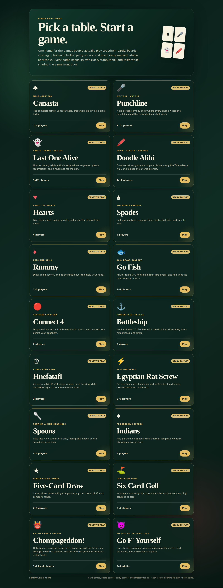

The hub discovers installed game modules automatically through Vite. A game owns its route, state machine, UI, rules, and tests; adding one does not require folding its rules into Canasta or another existing engine.

### Core experiences

| Experience | Games | Primary play style |
|---|---|---|
| Classic card room | Canasta, Hearts, Spades, Rummy | Online rooms, robots, private hands |
| Family card expansion | Egyptian Rat Screw, Spoons, Indians / Progressive Spades, Five-Card Draw, Six Card Golf | Online rooms and robot-capable shared table play |
| Tabletop expansion | Hnefatafl, Connect 4, Battleship, Go Fish, Go F' Yourself | Quick robot play or private rooms |
| Cooperative RPG | PixelQuest: The Living Dungeon | 1–8 remote browsers; one hero and one decision surface per player |
| Local arcade | Chompageddon! | 1–4 players sharing one screen/device |
| Party Stage | Punchline, Last One Alive, Doodle Alibi | TV/shared screen plus phones as controllers |

---

## PixelQuest: The Living Dungeon

**PixelQuest** is an original cooperative d20 fantasy RPG built directly inside the existing React/Vite/Firebase Family Game Room architecture. It is intentionally **not a shared-screen RPG**: every human player joins the same private room from their own browser, controls exactly one hero, and receives only the controls that belong to that hero or decision.

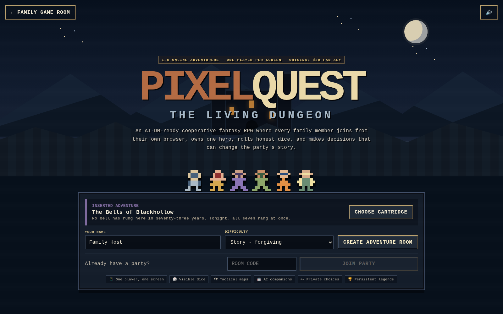

### Distributed multiplayer model

PixelQuest is designed for geographically separated family members playing over voice/video chat:

```text
     PLAYER 1 BROWSER       PLAYER 2 BROWSER       PLAYER 3 BROWSER
     Brom Stoneguard       Aldren Oathfire         Nyx Quickstep
     own votes             own votes               own votes
     own secrets           own secrets             own secrets
     own d20 turns         own d20 turns           own d20 turns
     own combat turn       own combat turn         own combat turn
             \                   |                    /
              \                  |                   /
               └──── Firebase Realtime Database ────┘
                           shared campaign truth
```

The multiplayer rules are explicit:

- **One online human = one unique hero.** A player cannot select or act as another player's hero.
- **Party decisions are independent votes.** Every human submits from their own browser. The final required human vote resolves the route automatically; tied choices use deterministic visible Fate Rolls.
- **Private scenes are genuinely per-player.** Each human receives a private decision on their own device. The public log only reveals that a decision was made, not which option was selected. The story waits until all required humans finish.
- **Private choices persist as campaign state.** Hero-specific flags survive later scenes instead of one player's choice overwriting another's.
- **Skill challenges give every human a turn.** Each player rolls their own d20 once. AI companions roll after the humans, and the group outcome is based on the party's combined successes.
- **Combat uses initiative ownership.** Only the browser belonging to the current human hero displays movement/ability/end-turn controls. Invalid actions from another user are rejected by the reducer. Enemy and AI-companion turns resolve automatically until the next human turn.
- **No one is eliminated from game night.** Defeat creates an in-world recovery penalty rather than removing a player from the session.

### Remote private decision

The screenshot below is captured from the **second independent browser session**, not from a shared host screen.

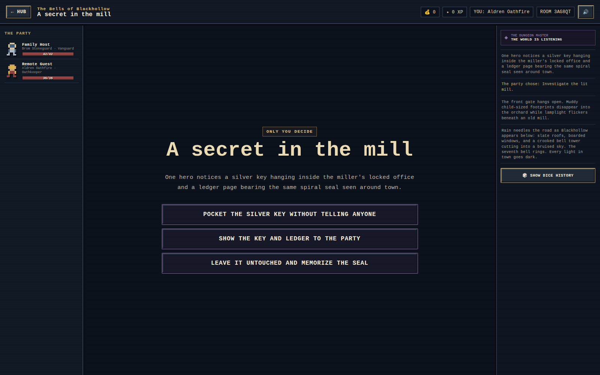

### Tactical combat

PixelQuest combat runs on a 12×8 tactical grid with movement, range, initiative, attack/defense rolls, healing, conditions, cooldowns, area effects, tile abilities, AI turns, defeat recovery, gold, XP, and visible dice history.

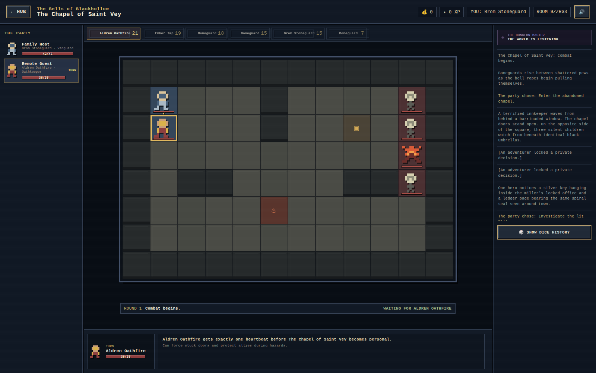

### Heroes and adventures

PixelQuest currently includes:

- **12 pregenerated heroes** with distinct classes, stats, roles, palettes, utility specialties, and at least five abilities each.
- **20 adventure cartridges** ranging from goblin raids and haunted manors to frozen wilderness, ghost ships, infernal gates, and a campaign finale.
- **7 enemy templates**, including the Bell Warden boss.
- Multiple tactical map layouts and environmental tiles.
- AI companions for empty party seats.
- Visible d20 checks, attack rolls, damage rolls, critical hits, and fumbles.
- Gold, XP, run statistics, save serialization, and a local Hall of Legends summary.

The deeper showcase adventure, **The Bells of Blackhollow**, includes multiple entrance routes, group decisions, individual secrets, skill challenges, branching encounters, hidden information, several combats, and a boss confrontation.

### Rules engine and Dungeon Master boundary

PixelQuest deliberately separates **rules truth** from narration:

- Seeded RNG determines dice outcomes.
- The engine owns HP, defense, movement, initiative, inventory/state flags, cooldowns, conditions, rewards, and legal actions.
- Narration may describe a result but does not secretly change a die roll or mutate authoritative combat state.
- `dm.js` currently provides the deterministic local narrator used by the playable build plus an `LlmNarrator` adapter boundary for a future hosted model endpoint.

There is **no browser-embedded LLM API key and no claim that the current narrator is a live hosted AI model**. A live generative DM should be connected through a secure server-side endpoint so model credentials never ship to the browser. The adapter already supplies campaign flags and immutable-rules context for that future integration.

### Firebase round-trip safety

Realtime Database removes empty objects/arrays during serialization. PixelQuest normalizes campaign state before online rules run so missing empty collections such as votes, flags, cooldowns, conditions, buffs, private choices, skill attempts, and combat objects are reconstructed safely. Regression tests intentionally simulate that Firebase pruning behavior.

---

## This week's expansion

The week of **August 10, 2026** expanded Family Game Room from a small card-room collection into a broader family game platform. The following **15 playable games** were added this week, including PixelQuest.

### Party Stage

These games use one shared TV/browser as the stage while players join from their phones. The TV owns the room code, presentation, music, recorded sound effects, short human voice cues, results, and final score presentation. Phones are private controllers for writing, voting, trivia, drawing, and mini-games.

<table>
<tr>
<td width="50%" valign="top">
<strong>Punchline</strong><br>
Comedy prompts, anonymous answers, head-to-head voting, Duel Mode for two players, and a Crowd Pleaser finale.<br><br>
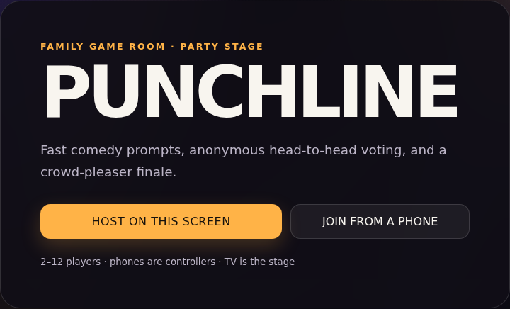
</td>
<td width="50%" valign="top">
<strong>Last One Alive</strong><br>
Horror-comedy trivia with hearts, traps, ghosts, resurrection, six micro-games, an escape finale, and 200+ tiered questions.<br><br>
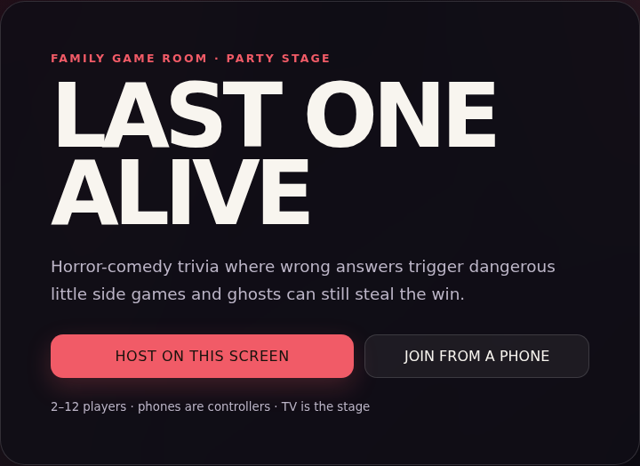
</td>
</tr>
<tr>
<td width="50%" valign="top">
<strong>Doodle Alibi</strong><br>
Phone drawing, hidden altered prompts, an evidence wall, accusation voting, two-player Detective Mode, and roughly 190 generated case combinations.<br><br>
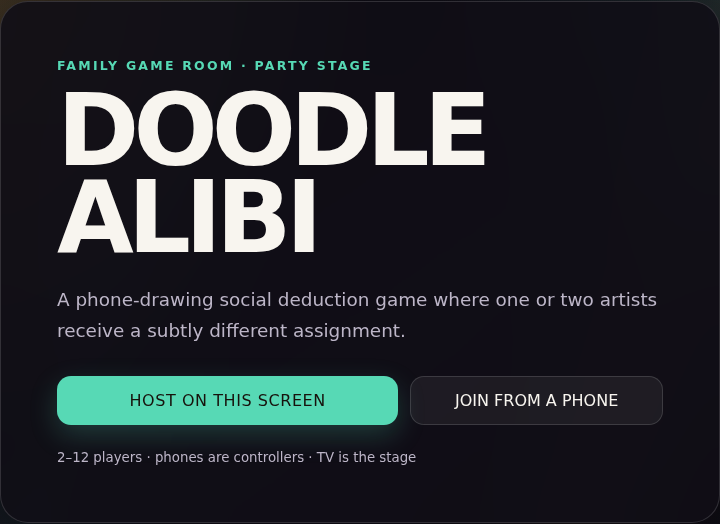
</td>
<td width="50%" valign="top">
<strong>Party Stage lifecycle</strong><br>
Rooms support replay in the same room, clean exits back to Family Game Room, stale-session expiration, host-controlled show ending, and reconnect behavior that does not permanently trap a browser in an old game state.
</td>
</tr>
</table>

### Strategy and tabletop games

<table>
<tr>
<td width="50%" valign="top">
<strong>Hnefatafl</strong><br>
An asymmetric 11×11 Viking siege. Defenders escort the king to a corner while raiders attempt to capture him.<br><br>
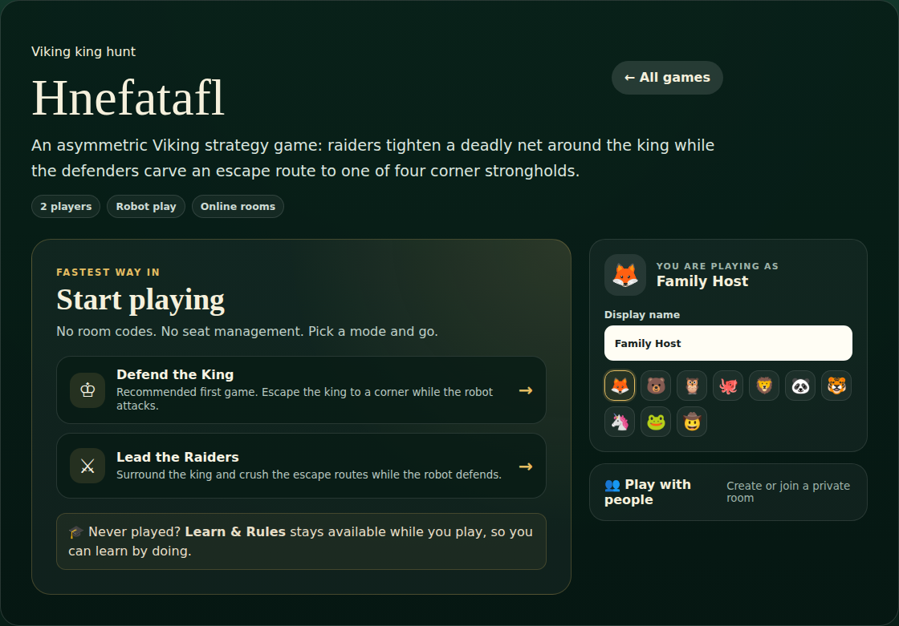
</td>
<td width="50%" valign="top">
<strong>Connect 4</strong><br>
Classic 7×6 connect-four play with responsive board rendering and robot blocking/winning logic.<br><br>

</td>
</tr>
<tr>
<td width="50%" valign="top">
<strong>Battleship</strong><br>
10×10 hidden-fleet play with auto-deployment, hits, misses, sinking, and hunt-style robot targeting.<br><br>
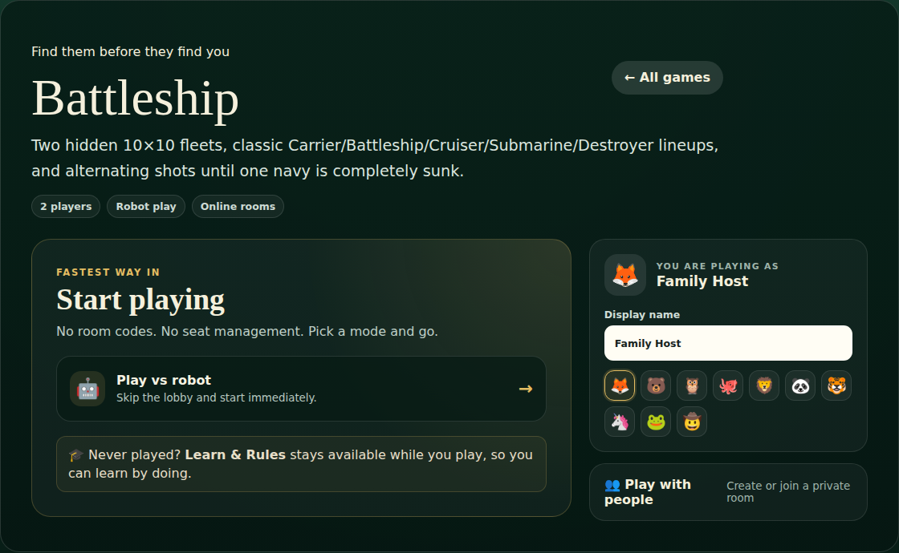
</td>
<td width="50%" valign="top">
<strong>Go Fish</strong><br>
Two-to-six-player book collection with grouped hands, rank asking, fishing, and robot play.<br><br>
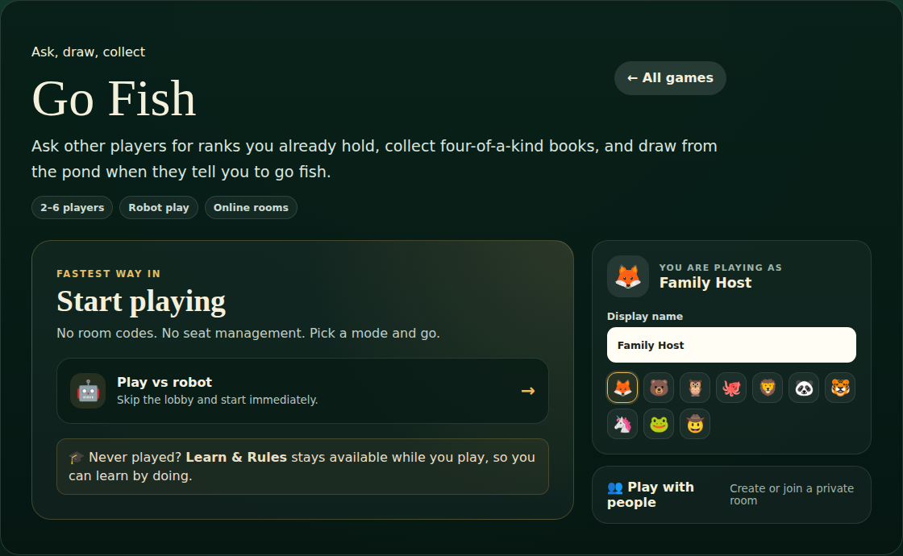
</td>
</tr>
<tr>
<td width="50%" valign="top">
<strong>Go F' Yourself · 18+</strong><br>
An adults-only Go Fish variant with a custom 52-card comedy deck, profanity, raunchy innuendo, and grouped matching sets.<br><br>
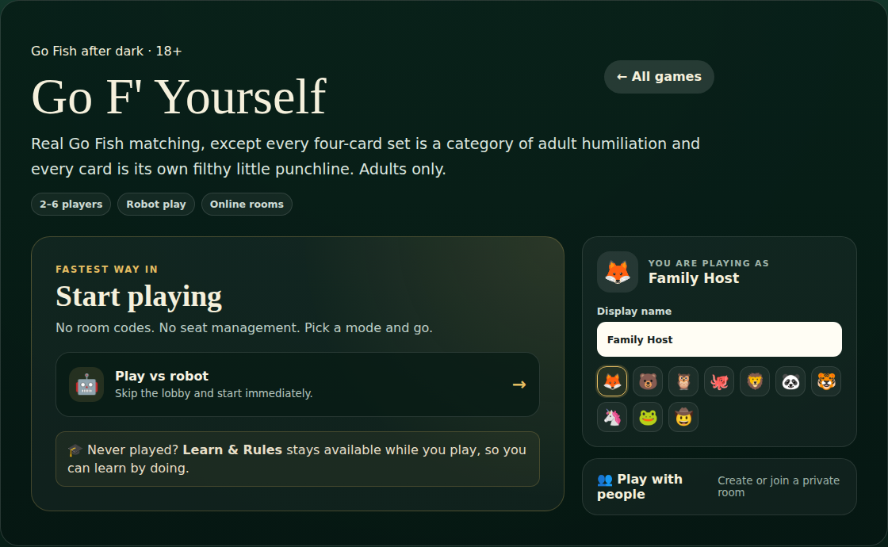
</td>
<td width="50%" valign="top">
<strong>Chompageddon!</strong><br>
A local physics arcade game for 1–4 players. Four monsters lunge into a bouncing ball pit while balls collide, ricochet, and get captured in real time.<br><br>
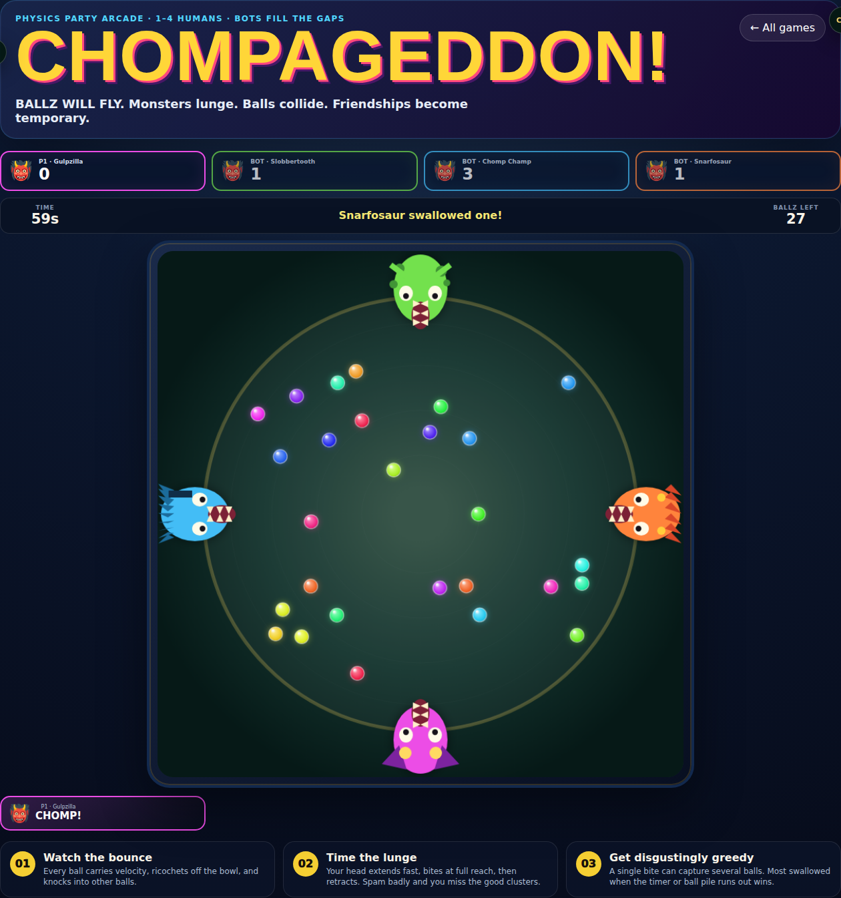
</td>
</tr>
</table>

### Family card expansion

<table>
<tr>
<td width="50%" valign="top">
<strong>Egyptian Rat Screw</strong><br>
Realtime online reaction play with face-card challenges, doubles, sandwiches, tens, marriage, runs, fast slapping, and reconnect-safe action handling.<br><br>
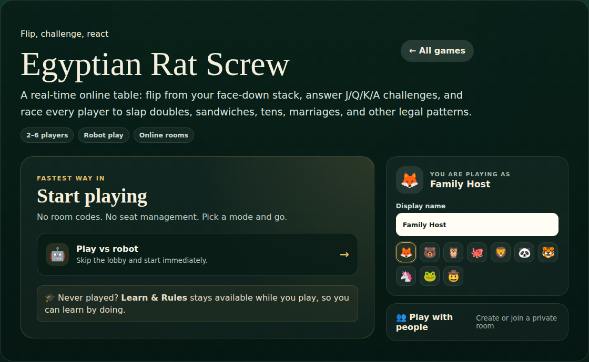
</td>
<td width="50%" valign="top">
<strong>Spoons</strong><br>
Pass cards quickly, make four of a kind, grab a spoon, and avoid spelling SPOON as players are eliminated.<br><br>

</td>
</tr>
<tr>
<td width="50%" valign="top">
<strong>Indians / Progressive Spades</strong><br>
A Family Game Room progressive-Spades house variant where a complete low rank disappears after each hand until the compact endgame.<br><br>

</td>
<td width="50%" valign="top">
<strong>Five-Card Draw</strong><br>
Family poker with standard hand rankings, draw structure, game points, fixed-size raises, and no real-money wagering.<br><br>
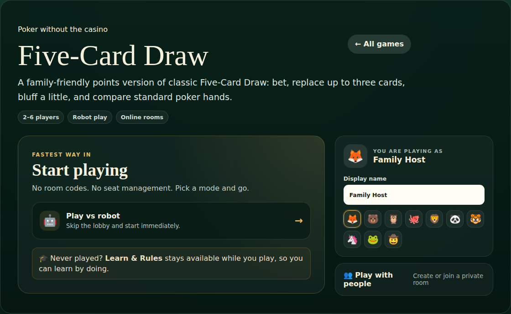
</td>
</tr>
<tr>
<td width="50%" valign="top">
<strong>Six Card Golf</strong><br>
A nine-hole low-score card game with a six-card grid and matching-column cancellation.<br><br>
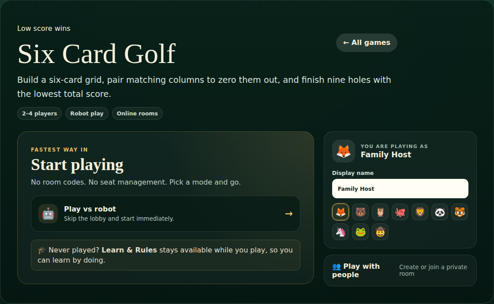
</td>
<td width="50%" valign="top">
<strong>Built for repeat family play</strong><br>
The expansion games share the same central hub and responsive platform but keep their gameplay engines isolated so a change in one game does not silently change another.
</td>
</tr>
</table>

---

## Original game room

The original four-game collection remains fully available.

| Game | Players | Core objective |
|---|---:|---|
| **Canasta** | 2–6 | Build melds and canastas, manage the discard pile, and reach the configured score target. |
| **Hearts** | 4 | Avoid penalty cards—or capture all of them and shoot the moon. |
| **Spades** | 4 | Bid with a partner, make the contract, protect nil, and manage bags. |
| **Basic Rummy** | 2–6 | Build sets and runs, lay off, and empty the hand first. |

The in-app **Learn & Rules** experience provides rules and step-by-step guidance for the installed games. Detailed engine documentation also lives beside individual game modules where appropriate.

---

## Game catalog

| Game | Route | Players | Mode |
|---|---|---:|---|
| Canasta | `?game=canasta` | 2–6 | Online / robots |
| Hearts | `?game=hearts` | 4 | Online / robots |
| Spades | `?game=spades` | 4 | Online / robots |
| Rummy | `?game=rummy` | 2–6 | Online / robots |
| Egyptian Rat Screw | `?game=ers` | 2–6 | Online reaction / robots |
| Spoons | `?game=spoons` | 3–6 | Online / robots |
| Indians / Progressive Spades | `?game=indians` | 4 | Online / robots |
| Five-Card Draw | `?game=poker` | 2–6 | Online / robots |
| Six Card Golf | `?game=golf` | 2–4 | Online / robots |
| Hnefatafl | `?game=hnefatafl` | 2 | Online / robot |
| Connect 4 | `?game=connect4` | 2 | Online / robot |
| Battleship | `?game=battleship` | 2 | Online / robot |
| Go Fish | `?game=gofish` | 2–6 | Online / robots |
| Go F' Yourself · 18+ | `?game=gofyourself` | 2–6 | Online / robots |
| **PixelQuest: The Living Dungeon** | `?game=pixelquest` | 1–8 | Distributed online cooperative RPG / AI companions |
| Chompageddon! | `?game=chompageddon` | 1–4 | Local simultaneous arcade |
| Punchline | `?game=punchline` | 2–12 phones | Shared TV + phones |
| Last One Alive | `?game=lastonealive` | 2–12 phones | Shared TV + phones |
| Doodle Alibi | `?game=doodlealibi` | 2–12 phones | Shared TV + phones |

---

## Platform capabilities

### Shared hub and modularity

- Central Family Game Room with stable `?game=<id>` routes.
- Vite `import.meta.glob` game discovery.
- Isolated game folders under `src/games/<game>/`.
- Shared responsive chrome for modular online games when a game wants it; full-screen games can own their entire presentation.
- Adaptive desktop, iPad, and phone layouts.
- Persistent player nickname and avatar preferences.
- Learn & Rules surfaces that stay available during play where appropriate.
- Automated test discovery and production builds through GitHub Actions.

### Online rooms

Games using the modular room system support combinations of:

- Firebase anonymous authentication.
- Private room codes.
- Realtime Database synchronization.
- Human and robot seats.
- Presence/disconnect handling.
- Transaction-based actions.
- Firebase-safe state normalization for empty/sparse collections.
- Quick play against robots without manually building a room first.

PixelQuest extends that room model with **per-user hero ownership**. Every action transaction identifies the acting Firebase user; narrative votes, private decisions, skill turns, and combat actions are validated against the hero assigned to that user's seat. No shared browser is required or assumed.

Canasta keeps its mature room implementation isolated from the newer modular-game room service.

### Party Stage

Party Stage adds a different realtime interaction model:

```text
            SHARED TV / HOST BROWSER
    ┌──────────────────────────────────┐
    │ room code · music · presentation │
    │ prompts · video · reveals        │
    │ results · scores · winner        │
    └────────────────┬─────────────────┘
                     │ Firebase realtime state
         ┌───────────┼───────────┐
         │           │           │
       PHONE       PHONE       PHONE
      answer       vote        draw
      trivia     mini-game    accuse
```

The host is display-only rather than consuming a player seat. Phones join via room code / QR path and become context-sensitive private controllers.

The current Party Stage audio layer uses recorded assets instead of browser speech synthesis or oscillator-generated music. See [`THIRD_PARTY_AUDIO.md`](THIRD_PARTY_AUDIO.md) for licensing and attribution.

---

## Architecture

```text
src/
├── HubApp.jsx                    # central catalog and route selection
├── games/
│   ├── canasta/                  # adapter to the original Canasta app
│   ├── hearts/
│   ├── spades/
│   ├── rummy/
│   ├── ers/
│   ├── spoons/
│   ├── indians/
│   ├── poker/
│   ├── golf/
│   ├── hnefatafl/
│   ├── connect4/
│   ├── battleship/
│   ├── gofish/
│   ├── gofyourself/
│   ├── pixelquest/               # distributed d20 campaign engine + RPG UI
│   │   ├── data.js               # heroes, enemies, maps, 20 adventures
│   │   ├── engine.js             # deterministic rules, dice, combat, saves
│   │   ├── network.js            # per-user Firebase action ownership
│   │   ├── dm.js                 # local narrator + hosted-LLM adapter boundary
│   │   ├── specialActions.js     # tile/gadget abilities
│   │   ├── PixelQuestGame.jsx    # full-screen game presentation
│   │   ├── engine.test.js
│   │   └── multiplayer.test.js
│   ├── chompageddon/
│   ├── punchline/
│   ├── lastonealive/
│   └── doodlealibi/
├── platform/
│   ├── ModularGameChrome.jsx
│   ├── useModularTable.js
│   ├── modularRoomService.js
│   └── party/                    # Party Stage room/audio/show infrastructure
└── App.jsx                       # mature original Canasta application
```

### PixelQuest state flow

```text
browser input
   ↓
useModularTable
   ↓
Firebase transaction
   ↓
reducePixelQuest(state, actorUid, action, members)
   ↓
normalize Firebase-pruned campaign collections
   ↓
validate actor/hero ownership
   ↓
deterministic PixelQuest engine
   ↓
new authoritative room state
   ↓
all remote browsers update through realtime listeners
```

### Design principle

The repository deliberately avoids one giant universal rules engine. A drawing game, an asymmetric Viking board game, a realtime slap game, a cooperative tactical RPG, and Canasta do not need the same state model. Shared services handle common platform behavior; rules remain local to each game.

---

## Local development

### Requirements

- Node.js 22 recommended.
- npm.
- A Firebase project for online room functionality.

### Install and run

```bash
npm install
npm run dev
```

Vite prints the local application URL. Open the hub and choose a game, or use a direct game route such as:

```text
http://localhost:5173/?game=pixelquest
http://localhost:5173/?game=connect4
http://localhost:5173/?game=chompageddon
http://localhost:5173/?game=punchline
```

### Firebase web configuration

The application reads Firebase configuration from Vite environment variables. Configure the matching values for the Firebase project used by the deployment:

```text
VITE_FIREBASE_API_KEY=
VITE_FIREBASE_AUTH_DOMAIN=
VITE_FIREBASE_DATABASE_URL=
VITE_FIREBASE_PROJECT_ID=
VITE_FIREBASE_STORAGE_BUCKET=
VITE_FIREBASE_MESSAGING_SENDER_ID=
VITE_FIREBASE_APP_ID=
VITE_FIREBASE_MEASUREMENT_ID=
```

Do not commit secrets that do not belong in a public web client. Firebase web configuration itself is public client configuration; database authorization belongs in Firebase rules.

For a future live generative PixelQuest DM, use a server-side endpoint or Firebase-hosted backend and keep the model credential there. Do **not** expose a model provider secret as a `VITE_*` client variable.

---

## Testing

Run full test discovery:

```bash
npm test
```

Build the production bundle:

```bash
npm run build
```

The `Validate` GitHub Actions workflow runs targeted regression groups, full Node test discovery, and the Vite production build.

### PixelQuest regression coverage

PixelQuest's automated tests cover, among other cases:

- All 20 adventure graphs and referenced scene links.
- Hero/enemy/map data integrity.
- Seeded deterministic dice and dice expressions.
- 1–8 player campaign construction.
- Independent human hero ownership.
- Multi-human votes and Fate-roll tie handling.
- Per-player private decisions and non-overwriting hero flags.
- One d20 skill turn per online human before group resolution.
- Initiative, movement legality, invalid targets, downed actors, cooldowns, and automatic AI/enemy turns.
- Wrong-browser combat actions being rejected.
- Combat turn ownership passing from one human hero to another.
- Victory, rewards, defeat recovery, save/load round trips, and Hall of Legends rewards.
- Firebase-pruned empty collections being reconstructed before online rules execute.

### README screenshot and live browser smoke capture

The repository contains a Playwright screenshot job:

```bash
node scripts/capture-readme-screenshots.mjs
```

`.github/workflows/readme-screenshots.yml` starts the application, captures the game surfaces, uploads the PNG set as the `readme-screenshots` workflow artifact, and commits stable README images under `docs/images/`.

PixelQuest's capture is intentionally an **integration smoke test**, not just a pretty screenshot. It creates a real Firebase room and two independent Playwright browser contexts with separate anonymous sessions. The test then verifies that:

1. The second browser joins using the host's room code.
2. The two users select different heroes.
3. Each browser submits its own party vote.
4. Each browser receives its own private decision; the host must wait after finishing while the guest still owns their unresolved secret turn.
5. Both clients synchronize into combat.
6. Exactly one player's browser has combat controls for the current hero.
7. Ending that hero's turn causes the other remote browser to receive the next human combat controls.
8. The title, private-choice, and tactical-combat screenshots are generated from the working flow.

That two-session smoke path is the acceptance test for the requirement that **PixelQuest players are online independently and do not share a screen**.

---

## Deployment

The production site is currently hosted through Firebase Hosting:

**https://family-canasta-ce7d2.web.app**

Typical deployment flow:

```bash
npm run build
npm run firebase:login
npm run firebase:deploy
```

Review Firebase Realtime Database rules before deploying room-service changes. A UI deployment does not replace database authorization.

---

## Security and privacy

Family Game Room is built around private family/friend use rather than hostile anonymous competition.

Current protections include:

- Firebase authentication for realtime rooms.
- Room membership checks in database rules.
- Transaction-based action validation for multiplayer state updates.
- PixelQuest actor ownership validation before hero/combat actions are accepted.
- Private PixelQuest choices stored per hero while public narration hides the selected option.
- Private card/drawing/controller information kept off shared TV surfaces when gameplay requires secrecy.
- Host controls for starting/ending rooms and removing players where supported.

A public commercial launch would still require additional work such as abuse prevention, moderation, account recovery, stronger identity controls, rate limiting, observability, formal privacy/legal review, and anti-cheat design appropriate to the game.

---

## Third-party assets

Party Stage uses freely licensed recorded audio assets. Licensing and attribution are documented in [`THIRD_PARTY_AUDIO.md`](THIRD_PARTY_AUDIO.md).

Chompageddon includes its own committed visual assets under `public/assets/chompageddon/`.

PixelQuest's current pixel characters, UI treatment, maps, adventure text, hero data, and game presentation are implemented in the repository rather than depending on a third-party RPG ruleset or commercial game asset pack.

---

## Extending Family Game Room

A new game normally follows this pattern:

1. Add `src/games/<game-id>/index.jsx`.
2. Keep the rule/state engine inside that game directory.
3. Reuse shared platform services only when the interaction model actually fits them.
4. Add the game to the hub catalog.
5. Add Learn & Rules content where the game uses that platform surface.
6. Add executable regression tests.
7. Add a screenshot/browser-smoke target to `scripts/capture-readme-screenshots.mjs`.
8. Run the full test suite and production build.

The core rule is simple: **share platform capabilities, not accidental game assumptions.**

---

## Repository status

Family Game Room is under active development. The fastest-changing areas are PixelQuest campaign depth and eventual hosted DM integration, Party Stage production quality, mobile/tablet usability, and the breadth of family-game experiences available from the central hub.
