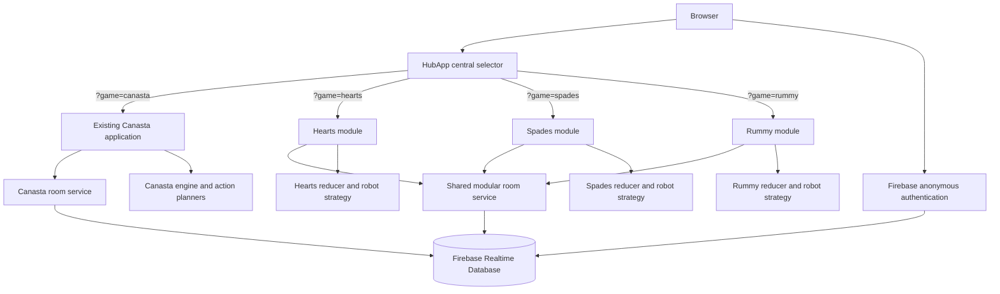

# Family Card Room

<p align="center">
  <strong>A realtime, browser-based family card game platform for Canasta, Hearts, Spades, and Rummy.</strong>
</p>

<p align="center">
  <a href="https://github.com/grumpystrongman/familycanasta/actions/workflows/validate.yml"></a>
  
  
  
  
</p>

<p align="center">
  <a href="https://family-canasta-ce7d2.web.app">Hosted application</a>
  ·
  <a href="#game-rules">Game rules</a>
  ·
  <a href="#local-development">Local development</a>
  ·
  <a href="#commercial-launch-readiness">Commercial readiness</a>
</p>

Family Card Room is a responsive React and Firebase application that gives families one central place to open a private table, share a six-character room code, add people or robots, and play a complete card game in the browser.

The product currently includes four independently implemented games:

- **Canasta** — configurable individual or partnership play for 2–6 players.
- **Hearts** — standard four-player American Hearts.
- **Spades** — standard four-player partnership Spades.
- **Rummy** — Basic/Straight Rummy for 2–6 players.

Each game owns its rules, scoring, robot behavior, table interface, and tests. The central hub discovers installed games automatically, while the mature Canasta application remains isolated from the newer game engines.

> **Product posture:** The application is suitable for trusted private family rooms, demonstrations, and controlled beta use. It is not yet hardened for anonymous public competition, wagering, or paid commercial launch. See [Commercial launch readiness](#commercial-launch-readiness) and [Security and privacy](#security-and-privacy).

---

## Product screenshots

The images below are captured from the running application with Playwright. The capture script creates real Firebase rooms and fills open seats with robots so the documentation reflects the actual product rather than a design mockup.

### Central game hub


### Canasta


### Hearts


### Spades


### Rummy


---

## What the application can do

### Shared platform capabilities

- Central game-selection hub with stable `?game=<id>` routes.
- Lazy discovery of game modules through Vite `import.meta.glob`.
- Browser-based play with no application download.
- Firebase anonymous authentication.
- Six-character private room codes that avoid ambiguous characters.
- Host-created lobbies and shareable room codes.
- Realtime room synchronization through Firebase Realtime Database.
- Presence tracking with disconnect handling.
- Human and robot seats.
- Host-controlled game start.
- Realtime, transaction-based game actions.
- Standard 52-card rendering shared by Hearts, Spades, and Rummy.
- Responsive layouts for desktop, tablet, and phone-sized browsers.
- Persistent local display name and avatar preferences.
- Friendly error states for missing Firebase configuration and rejected moves.
- Startup and enhancement error boundaries so optional Canasta display features cannot take down core play.
- Automated rule, runtime, isolation, and production-build validation in GitHub Actions.
- Firebase Hosting deployment configuration.

### Capability matrix

| Capability | Canasta | Hearts | Spades | Rummy |
|---|:---:|:---:|:---:|:---:|
| Realtime private rooms | ✓ | ✓ | ✓ | ✓ |
| Six-character room codes | ✓ | ✓ | ✓ | ✓ |
| Human players | ✓ | ✓ | ✓ | ✓ |
| Fill-in robots | ✓ | ✓ | ✓ | ✓ |
| Responsive card table | ✓ | ✓ | ✓ | ✓ |
| Executable rule engine | ✓ | ✓ | ✓ | ✓ |
| Automated rule tests | ✓ | ✓ | ✓ | ✓ |
| Multiple rounds or hands | ✓ | ✓ | ✓ | ✓ |
| Persistent game scoring | ✓ | ✓ | ✓ | ✓ |
| Partnership play | Configurable | — | Fixed | — |
| In-table text chat | ✓ | — | — | — |
| Animated emotes | ✓ | — | — | — |
| Optional Google Meet link | ✓ | — | — | — |
| Action-history timeline | ✓ | — | — | — |
| Undo most recent meld play | ✓ | — | — | — |
| Turn overlay and reminder timer | ✓ | — | — | — |
| Drag ordering and auto-sort | ✓ | Automatic sort | Automatic sort | Automatic sort |
| Dedicated rule document | Engine/tests | ✓ | ✓ | ✓ |

A dash means the capability is not currently implemented for that game, not that the underlying platform could never support it.

---

## Game catalog

| Game | Players | Format | Default target | Core objective |
|---|---:|---|---:|---|
| Canasta | 2–6 | Individual teams or two-person partnerships | 5,000 points | Build melds and canastas, then go out with the strongest score. |
| Hearts | 4 | Individual | Lowest score when someone reaches 100 | Avoid hearts and the queen of spades, or shoot the moon. |
| Spades | 4 | Two fixed partnerships | 500 points | Bid accurately, make the team contract, manage bags, and protect nil. |
| Basic Rummy | 2–6 | Individual | 100 points | Build sets and suit runs, lay off cards, and empty the hand first. |

---

## Canasta capabilities

Canasta is the original and most feature-rich table in the application. Its existing engine and Firebase room model remain the source of truth and are intentionally not reused by the other games.

### Game setup

- Quick-play head-to-head game against one robot.
- Individual-team mode with 2–4 teams.
- Partnership mode with 2–3 two-person teams.
- Total table sizes from 2–6 players.
- Two- or three-deck configuration.
- Configurable starting hand of 11, 13, or 15 cards.
- Multiple card-back themes.
- Optional Google Meet link attached to the lobby.
- Team selection before the game starts.
- Host-selected board keeper for each team.
- Robots can be added and removed from open seats.
- Random first dealer and clockwise dealer rotation.
- Animated dealing.

### Live table

- Private local hand with selectable, draggable cards.
- Non-shrinking large cards designed to keep hands of 20 or more cards playable.
- Horizontal hand scrolling rather than shrinking cards until they are unreadable.
- Independent stock and discard controls.
- Team meld boards with independently scrollable viewports.
- Sticky board headings and compact completed-canasta presentation.
- Clean and dirty canasta identification.
- Red-three racks and automatic red-three handling.
- Opening-meld requirement display.
- Current board values, clean/dirty book bonuses, red-three values, and cumulative team scores.
- Public opponent hand counts without showing Canasta card identities.
- Table chat, chat bubbles, animated emotes, and readable chat styling.
- Dedicated tabs for game score, table chat, and public table actions.
- Full action timeline with actor, timestamp, and action category.
- Automatic hand sorting preference plus manual sort.
- Safe undo for the most recent eligible meld action.
- Large “YOUR TURN” notification and one-minute reminder countdown.
- Robot-turn watchdog so a missed host timer does not permanently freeze the table.
- End-of-hand scoring, next-hand flow, game-over state, and celebration treatment.

### Rule support

- Same-rank meld validation.
- Natural-card and wild-card balance enforcement.
- Jokers and twos as wild cards.
- Configurable maximum wild cards per meld.
- Opening requirements based on the team’s cumulative score.
- Frozen and unfrozen discard-pile pickup rules.
- Existing-board-meld pickup behavior for an eligible unfrozen pile.
- Support-card removal and top-discard incorporation when claiming the pile.
- Opening discard pile begins frozen.
- Black-three and wild-card discard behavior.
- Red-three replacement draws.
- Required canasta count before going out.
- Optional partner permission before going out.
- Stock-exhaustion and blocked-discard-pile hand endings.
- Clean/dirty canasta, red-three, going-out, board-card, and hand-penalty scoring.

---

## Game rules

The summaries below describe the rules implemented by the engines. They are product behavior, not a complete history of every regional or house variant.

### Canasta rules implemented

#### Table and deck

- The host chooses 2–6 players through individual-team or partnership formats.
- The game uses two decks by default and three decks for larger tables.
- Each deck includes two jokers.
- The host may choose 11, 13, or 15 starting cards. The default is 15 cards in a two-player game and 11 in larger games.
- The default game target is 5,000 points.

#### Turn sequence

1. Draw two cards from the stock, or legally claim the discard pile.
2. Optionally create melds or add cards to existing team melds.
3. Discard one card to end the turn.

#### Melds and canastas

- A meld contains cards of one natural rank.
- A new meld requires at least three cards.
- Twos and jokers are wild.
- A meld must retain more natural cards than wild cards and cannot exceed the configured wild-card limit.
- A meld of seven or more cards is a canasta.
- A **clean canasta** contains no wild cards and is worth a 500-point bonus by default.
- A **dirty canasta** contains one or more wild cards and is worth a 300-point bonus by default.
- Wild canastas are disabled by default.

#### Opening requirement

A team’s first meld or group of melds in a hand must meet the score-based opening requirement:

| Cumulative team score | Required opening value |
|---:|---:|
| Below 0 | 15 |
| 0–1,499 | 50 |
| 1,500–2,999 | 90 |
| 3,000 or more | 120 |

#### Discard pile

- The opening discard pile starts frozen.
- A frozen pile requires the configured natural-card support to match the top discard.
- An eligible unfrozen pile can use an existing matching team meld under the implemented Classic Canasta behavior.
- When the pile is claimed, the top discard is applied to the legal meld and the remaining pile moves into the player’s hand.
- The interface prevents illegal pickup attempts and explains why a pile cannot be taken.

#### Red threes

- Red threes are placed in the team’s red-three area rather than retained as ordinary hand cards.
- A replacement card is drawn when available.
- Red threes are worth 100 points each by default.
- The engine supports an optional unprotected-red-three penalty when a team has no canasta.

#### Going out and scoring

- A player may go out only after the team has the configured number of canastas.
- Partner permission can be required in partnership games.
- Going out is worth 100 points by default.
- Each hand combines board card points, canasta bonuses, red-three scoring, and the going-out bonus, then subtracts cards remaining in team members’ hands.
- The first team to reach the configured target after hand scoring wins.

### Hearts rules implemented

The Hearts engine follows standard four-player American Hearts. The full implementation notes are in [`src/games/hearts/rules.md`](src/games/hearts/rules.md).

#### Table and objective

- Four individual players use one standard 52-card deck.
- Aces are high and there is no trump suit.
- Each heart is worth 1 penalty point.
- The queen of spades is worth 13 penalty points.
- The game ends after a hand in which at least one player reaches 100 points; the lowest total score wins.

#### Passing cycle

The cycle repeats every four hands:

1. Pass three cards left.
2. Pass three cards right.
3. Pass three cards across.
4. Hold; no cards are passed.

Passes are simultaneous. Incoming cards are hidden until all required players submit their selections.

#### Trick play

- The player holding the two of clubs leads the first trick.
- Players must follow the led suit when able.
- Hearts and the queen of spades cannot be discarded on the first trick when a non-penalty alternative is available.
- Hearts cannot be led until hearts have been broken, unless the leader holds only hearts.
- The highest card in the led suit wins the trick and leads next.

#### Shooting the moon

A player who captures all 13 hearts and the queen of spades shoots the moon. The shooter receives zero points for the hand and every opponent receives 26.

Deliberately excluded variants include partnership Hearts, kitty games, the jack-of-diamonds bonus, Spot Hearts, and subtracting 26 from the shooter.

### Spades rules implemented

The Spades engine follows standard four-player partnership Spades. The full implementation notes are in [`src/games/spades/rules.md`](src/games/spades/rules.md).

#### Table and objective

- Four players sit in fixed partnerships: seats 1 and 3 against seats 2 and 4.
- A standard 52-card deck is dealt completely, giving each player 13 cards.
- Spades are always trump.
- The first team to at least 500 points after a completed hand wins, provided it has the higher score.

#### Bidding

- Bidding begins left of the dealer and proceeds clockwise.
- Each player bids from zero through thirteen.
- A zero bid is nil: the player promises to win no tricks.
- A partnership contract is the sum of its partners’ non-nil bids.

#### Trick play

- The player left of the dealer leads the first trick.
- Players must follow suit when able.
- A player unable to follow suit may play any card, including a spade.
- Spades cannot be led until broken unless the leader holds only spades.
- The highest spade wins a trick containing trump; otherwise, the highest card in the led suit wins.

#### Scoring

- Making the contract earns 10 points per contracted trick plus one point per overtrick.
- Missing the contract loses 10 points per contracted trick.
- Overtricks are bags.
- Every ten accumulated bags causes a 100-point penalty and removes ten bags.
- Successful nil is worth +100; failed nil is worth -100.
- Tricks taken by a nil bidder still count toward the team’s contract and bags.

Deliberately excluded variants include blind nil, jokers, deuce-high rules, board bidding, and shorter 200/250-point games.

### Basic Rummy rules implemented

This is **Basic/Straight Rummy**, not Gin Rummy or 500 Rummy. The full implementation notes are in [`src/games/rummy/rules.md`](src/games/rummy/rules.md).

#### Players and deal

- Two through six players use one standard 52-card deck without jokers.
- Two players receive 10 cards each.
- Three or four players receive 7 cards each.
- Five or six players receive 6 cards each.
- One card begins the discard pile and the remaining cards form the stock.

#### Turn sequence

1. Draw exactly one card from the stock or the top of the discard pile.
2. Optionally play one or more melds.
3. After opening with a meld of their own, optionally lay cards onto existing melds.
4. Discard one card to end the turn.

A player can go out without discarding when every remaining card is legally melded or laid off. If the stock empties, the discard pile beneath its top card is shuffled into a new stock.

#### Melds

- A set contains three or four cards of the same rank.
- A run contains at least three consecutive cards of the same suit.
- Ace is low only: A-2-3 is valid; Q-K-A and K-A-2 are not.
- A layoff must leave the complete table group as a valid set or run.

#### Scoring

The round winner receives the combined deadwood value left in all opponents’ hands:

- Ace: 1 point.
- Number cards: face value.
- Tens and face cards: 10 points.

The first player to reach 100 cumulative points after a completed round wins.

Deliberately excluded variants include Gin Rummy, Oklahoma Gin, 500 Rummy pile pickup/scoring, jokers, wild cards, multiple decks, high-ace runs, wraparound runs, and opening-point thresholds.

---

## Typical user journey

1. Open the Family Card Room hub.
2. Select Canasta, Hearts, Spades, or Rummy.
3. Choose a display name and avatar.
4. Create a private room or enter a six-character room code.
5. Share the code with family members.
6. Fill remaining seats with robots when needed.
7. The host starts the game once the table requirements are met.
8. Every accepted action is synchronized through Firebase in realtime.
9. Continue through rounds or hands until the game’s scoring target is reached.

---

## Architecture



### Design boundaries

- `src/HubApp.jsx` is the central entry point.
- Vite discovers `src/games/*/index.jsx` automatically.
- Each installed game has a stable route such as `/?game=hearts`.
- Canasta is registered through `src/games/canasta/index.jsx`, which re-exports the existing `src/App.jsx`.
- Canasta rules remain in `src/game/` and are not generalized into the newer games.
- Hearts, Spades, and Rummy use the additive `src/platform/modularRoomService.js` transaction layer.
- Each newer game has its own pure engine/reducer, UI, styles, robot policy, rule documentation, and tests.
- Optional Canasta enhancements load only on the Canasta route and fail independently from the core application.

See [`docs/multi-game-architecture.md`](docs/multi-game-architecture.md) for the module contract and isolation requirements.

### Repository structure

```text
familycanasta/
├── .github/workflows/
│   ├── validate.yml
│   └── readme-screenshots.yml
├── docs/
│   ├── images/
│   └── multi-game-architecture.md
├── public/
│   └── avatars/
├── scripts/
│   └── capture-readme-screenshots.mjs
├── src/
│   ├── App.jsx                    # Existing Canasta application
│   ├── HubApp.jsx                 # Central game selector and route loader
│   ├── game/                      # Canasta rules, scoring, planners, robots
│   ├── games/
│   │   ├── canasta/               # Thin adapter to App.jsx
│   │   ├── hearts/                # Hearts UI, engine, rules, tests
│   │   ├── spades/                # Spades UI, engine, rules, tests
│   │   └── rummy/                 # Rummy UI, engine, rules, tests
│   ├── platform/
│   │   ├── modularRoomService.js  # Shared rooms/actions for new games
│   │   ├── StandardCard.jsx
│   │   └── standardDeck.js
│   ├── services/
│   │   └── roomService.js         # Canasta-specific room service
│   ├── firebase.js
│   └── main.jsx
├── database.rules.json
├── firebase.json
├── package.json
└── vite.config.js
```

---

## Firebase data model

The exact state differs between Canasta and the modular games, but the high-level structure is:

```text
roomDirectory/{roomCode}
  roomCode
  gameId
  createdAt

rooms/{roomCode}
  gameId
  schemaVersion
  hostUid
  status
  rules
  members/{uid}
  messages/{messageId}           # Canasta
  privateHands/{uid}             # Canasta
  publicState                    # Canasta
  gameState                      # Hearts, Spades, Rummy
```

### Realtime action model

- Room creation reserves a unique code with a Firebase transaction.
- Hosts and joining players write lobby membership records.
- Room watchers receive realtime snapshots.
- Game actions execute through Firebase `runTransaction`.
- The relevant game reducer validates the proposed action and returns the next state.
- Invalid actions abort the transaction and return a user-facing error.
- Robots submit actions through the same reducers used by humans.

---

## Technology stack

- **React** — component-based browser interface.
- **Vite** — development server, module discovery, and production build.
- **Firebase Authentication** — anonymous sessions.
- **Firebase Realtime Database** — rooms, presence, actions, hands, scoring, and chat.
- **Firebase Hosting** — static web deployment.
- **Framer Motion** — Canasta motion and interaction feedback.
- **Lucide React** — interface icons.
- **Node test runner** — rules and regression tests.
- **Playwright** — reproducible product screenshot capture.
- **GitHub Actions** — test, build, and screenshot workflows.

---

## Local development

### Requirements

- Node.js 22 or a compatible maintained Node release.
- npm.
- A Firebase project with Anonymous Authentication and Realtime Database enabled.
- Firebase CLI for deployment.

### Install

```bash
git clone https://github.com/grumpystrongman/familycanasta.git
cd familycanasta
npm install
cp .env.example .env.local
```

Populate `.env.local` with the public Firebase web configuration for your project:

```dotenv
VITE_FIREBASE_API_KEY=your_web_api_key
VITE_FIREBASE_AUTH_DOMAIN=your-project.firebaseapp.com
VITE_FIREBASE_DATABASE_URL=https://your-project-default-rtdb.firebaseio.com
VITE_FIREBASE_PROJECT_ID=your-project
VITE_FIREBASE_STORAGE_BUCKET=your-project.firebasestorage.app
VITE_FIREBASE_MESSAGING_SENDER_ID=your_sender_id
VITE_FIREBASE_APP_ID=your_web_app_id
VITE_FIREBASE_MEASUREMENT_ID=your_measurement_id
```

Start the development server:

```bash
npm run dev
```

Open the URL printed by Vite. Useful direct routes include:

```text
/?game=canasta
/?game=hearts
/?game=spades
/?game=rummy
```

### Available commands

| Command | Purpose |
|---|---|
| `npm run dev` | Start the Vite development server. |
| `npm test` | Run all discovered Node tests. |
| `npm run build` | Create the production bundle in `dist/`. |
| `npm run preview` | Serve the production bundle locally. |
| `npm run firebase:login` | Authenticate the Firebase CLI. |
| `npm run firebase:deploy` | Deploy configured Firebase resources. |

---

## Firebase setup

1. Create a Firebase project.
2. Register a web application.
3. Enable **Anonymous** under Authentication → Sign-in method.
4. Create a Realtime Database.
5. Review and deploy `database.rules.json`.
6. Copy the public web configuration into `.env.local`.
7. Update `.firebaserc` when deploying to a project other than the included example project.

Deploy rules and hosting with:

```bash
npm run build
npx firebase login
npx firebase use your-project-id
npx firebase deploy
```

The included example configuration targets:

```text
family-canasta-ce7d2
https://family-canasta-ce7d2.web.app
```

Do not assume the hosted site reflects the latest `main` branch until a Firebase deployment has completed.

---

## Testing and quality controls

The repository uses Node’s built-in test runner. The GitHub Actions validation workflow runs:

- Canasta grouped-meld planner tests.
- Canasta opening-requirement and scoring tests.
- Canasta discard-pile pickup tests.
- Canasta robot pickup tests.
- Full test discovery across all games and enhancements.
- Hearts rule and runtime tests.
- Spades rule and runtime tests.
- Rummy rule and runtime tests.
- Game-isolation tests that prevent cross-imports into the Canasta engine.
- Production Vite build.

Run the same core checks locally:

```bash
npm test
npm run build
```

### Screenshot validation

The screenshot workflow:

1. Loads the public Firebase web configuration.
2. Starts the local Vite application.
3. Opens the hub in Chromium.
4. Creates actual Canasta, Hearts, Spades, and Rummy rooms.
5. Adds robots and deals each game.
6. Captures the table interfaces as workflow artifacts.

The reusable script is:

```text
scripts/capture-readme-screenshots.mjs
```

---

## Adding another game

A new game does not require editing a central registry. Add a directory under `src/games/<game-id>/` with a default React export from `index.jsx`.

Recommended structure:

```text
src/games/euchre/
├── EuchreGame.jsx
├── engine.js
├── engine.test.js
├── index.jsx
├── isolation.test.js
├── rules.md
├── runtime.test.js
└── styles.css
```

Minimum expectations for a production-quality game module:

- Written rules baseline and deliberate exclusions.
- Pure state creation and action reducer.
- Legal-action validation in the reducer, not only in the UI.
- Round/hand completion and game-over scoring.
- Robot decision policy.
- Responsive lobby and table.
- Executable rule tests.
- Runtime transition tests.
- Isolation test preventing Canasta dependencies.
- Production build validation.

---

## Security and privacy

### Current protections

- Firebase requires authenticated sessions before room access.
- Anonymous authentication avoids collecting passwords.
- Canasta hands are stored under `privateHands/{uid}` and read access is limited to the matching authenticated user.
- Room codes are difficult to guess casually and avoid visually ambiguous characters.
- Modular actions run inside database transactions and the game reducer rejects illegal actions.
- The UI does not display opponents’ private cards.

### Important limitations

The current Firebase rules are designed for trusted family rooms, not adversarial public competition.

- Authenticated room members have broad write access within a room.
- Hearts, Spades, and Rummy currently store all hands inside shared `gameState`; the interface hides them, but a technically knowledgeable room member could inspect Firebase traffic or state.
- Anonymous identities do not provide durable account ownership, recovery, reputation, bans, or cross-device identity.
- Game actions are validated in browser-shipped JavaScript and Firebase transactions rather than by a trusted server process.
- There is no rate limiting, abuse detection, moderation console, or audit-grade event ledger.
- There is no automatic room expiration or documented retention/deletion policy.

Do not use the current implementation for real-money play, prizes, ranked public tournaments, or environments where cheating creates material harm.

---

## Commercial launch readiness

### Ready today

- Four complete playable card games.
- Central branded game hub.
- Private realtime rooms.
- Human and robot play.
- Responsive browser interface.
- Core scoring and round progression.
- Automated tests and production build checks.
- Firebase deployment path.
- Modular architecture for adding games independently.
- Reproducible product screenshot automation.

### Required before a public paid launch

| Area | Required work |
|---|---|
| Identity | Add permanent accounts, account recovery, profile management, consent, and session/device controls. |
| Anti-cheat | Move dealing, private hands, legal-action validation, and authoritative state transitions to trusted server functions or a dedicated backend. |
| Data isolation | Store each player’s hand in owner-readable paths for every game, not inside shared modular `gameState`. |
| Authorization | Replace broad room-member writes with action-specific server APIs and least-privilege database rules. |
| Abuse prevention | Add rate limits, room throttles, spam controls, bans, block/report tools, and moderator workflows. |
| Observability | Add structured logs, crash reporting, performance monitoring, alerting, tracing, and operational dashboards. |
| Product analytics | Define privacy-respecting funnels, retention metrics, game completion metrics, and bot/human segmentation. |
| Legal | Publish Terms of Service, Privacy Policy, acceptable-use rules, age requirements, cookie disclosures, and regional data notices. |
| Accessibility | Complete keyboard-only, screen-reader, contrast, reduced-motion, zoom, and WCAG audit work across every game. |
| Quality assurance | Establish supported browser/device versions and run repeatable cross-browser, mobile, latency, reconnect, and load testing. |
| Reliability | Add room cleanup, data retention, backup/restore procedures, incident response, and service-level objectives. |
| Dependency management | Pin production dependency versions, commit a lockfile, and add automated vulnerability and update management. |
| Commerce | Add subscription or purchase flows, entitlements, receipts, refunds, tax handling, and fraud controls if monetized. |
| Support | Add in-product help, rules access, contact/support workflow, diagnostics, and admin tooling. |
| Brand and assets | Confirm ownership or licensing for every name, logo, image, font, sound, and card design used commercially. |
| Repository licensing | Add an explicit software license before inviting external reuse or contribution. |

### Recommended launch stages

1. **Private family alpha** — trusted users, direct support, no payments.
2. **Invite-only beta** — telemetry, crash reporting, accessibility fixes, and structured feedback.
3. **Public free beta** — hardened accounts, moderation, rate limits, private hand storage, and server authority.
4. **Commercial release** — legal, payments, support operations, observability, security review, and load validation.

---

## Accessibility and responsive behavior

The current interface includes:

- Semantic buttons and labels for primary controls.
- Visible selected-card states.
- Large Canasta cards that do not shrink into unreadability when hands grow.
- Horizontal scrolling for large hands.
- Scrollable team boards and action timelines.
- Sticky table headings where long content requires scrolling.
- Responsive game panels for narrower screens.
- Text alternatives for image-backed avatars.
- User-facing error and status messages.

A formal accessibility certification has not been completed. Commercial release should include WCAG testing with keyboard users, screen readers, high zoom, high contrast, and reduced motion.

---

## Troubleshooting

### The application says Firebase is not configured

Confirm every required `VITE_FIREBASE_*` variable exists in `.env.local`, then restart Vite. Environment changes are not picked up reliably by an already running development server.

### A room code is not found

- Confirm the code belongs to the selected game.
- Confirm all six characters were entered.
- Confirm the room still exists in Realtime Database.
- Hearts, Spades, and Rummy reject codes created for another game.

### A host cannot start the game

- Hearts and Spades require exactly four seats.
- Rummy requires at least two seats.
- Canasta requires every configured team to be full and every team to have a board keeper.
- Add robots to fill open seats.

### A move is rejected

The transaction may have lost a race to another client or the move may violate the current game phase or rules. Refresh the table state and try a legal action.

### The hosted application does not show a merged feature

Merging to `main` does not deploy Firebase Hosting automatically in the current repository. Run the Firebase deployment commands or add a controlled deployment workflow.

---

## Roadmap ideas

The architecture is ready for additional isolated games such as Euchre, Pinochle, Gin Rummy, Crazy Eights, Go Fish, or Bridge-style trick-taking variants. New additions should remain independent modules rather than adding conditional rules to an existing engine.

Platform-level roadmap candidates:

- Permanent family accounts and profiles.
- Shared chat and emotes for every game.
- Spectator mode.
- Reconnect and cross-device game recovery.
- In-app rules and guided tutorials.
- Difficulty levels for every robot.
- Match history and personal statistics.
- Invitations and family groups.
- Private server-authoritative hands for all games.
- Automated room expiration and archival.
- Localization.
- Installable Progressive Web App support.
- Native sharing and notifications.
- Tournament and league formats after anti-cheat hardening.

---

## Maintainer

Created and maintained by **Jeff Barnes** (`@grumpystrongman`).

- GitHub: [grumpystrongman](https://github.com/grumpystrongman)
- LinkedIn: [Jeff Barnes](https://www.linkedin.com/in/cmajeff/)

---

## License status

This repository does not currently include a software license. Copyright remains with the repository owner by default. Add an explicit license before commercial distribution, external contribution, forking, or reuse is encouraged.
