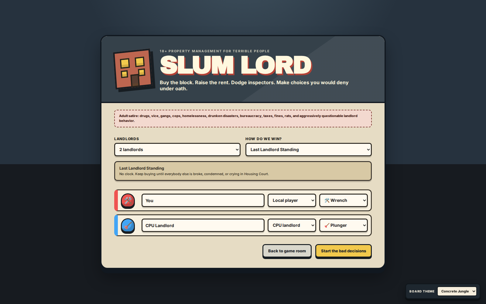
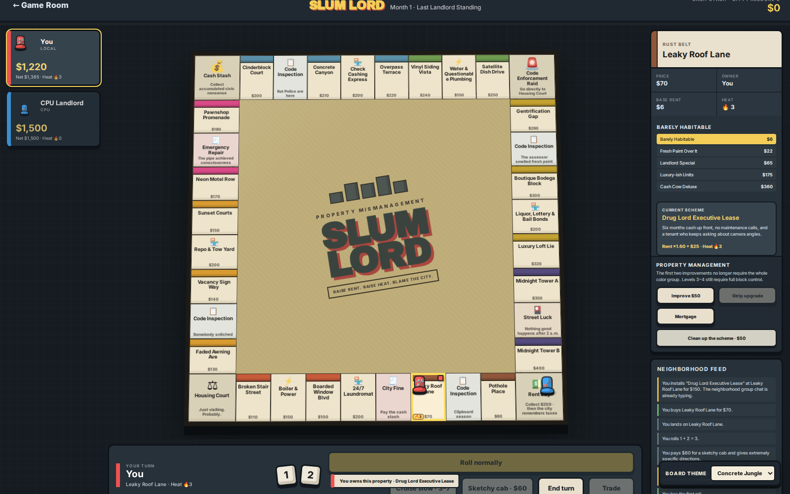
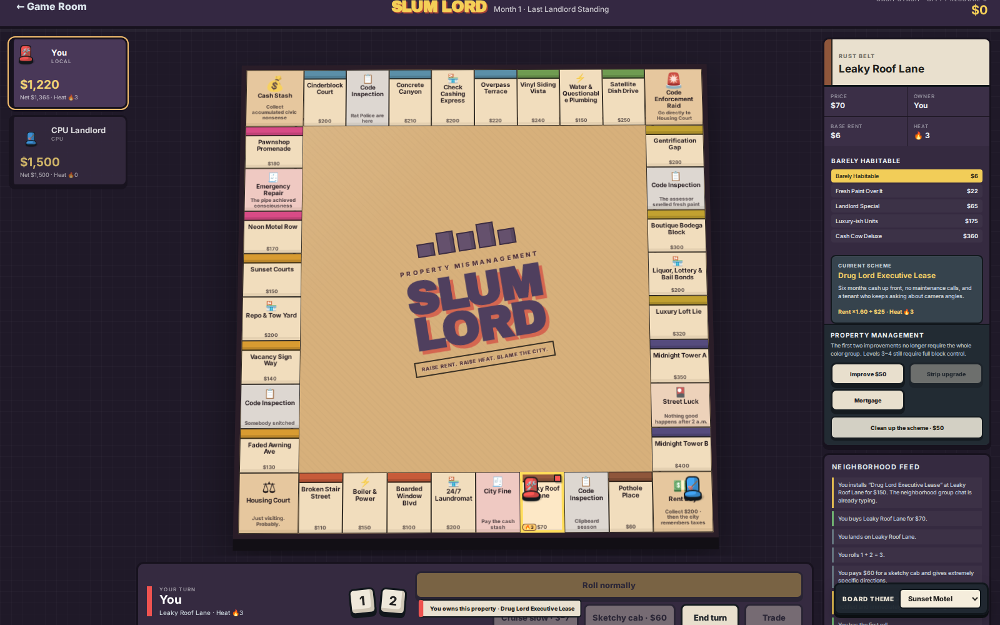

# Slum Lord

**Slum Lord** is an 18+ single-screen property-trading game inside Family Game Room. The original prototype had the right board-game skeleton but too many turns boiled down to “roll, move, maybe buy.” This redesign turns it into a dirtier neighborhood-management game where movement, improvements, rent schemes, Heat, inspections, taxes, auctions, trades, and cash pressure all create real decisions.

The satire is aimed primarily at predatory landlords, bureaucracy, cops, inspectors, neighborhood rackets, gentrification, and bad incentives. Vulnerable people are part of the setting, not the default punchline.

## Screenshots

### Default solo setup

Slum Lord defaults to **one human vs one CPU landlord** and **Last Landlord Standing**. There is no arbitrary 25-round ending.



### Tactical property management

The gameplay capture intentionally proves the new loop: the human uses a paid exact-movement cab, targets Leaky Roof Lane, buys it, and installs a high-Heat rent scheme.



### Alternate N64-style palette

Themes still change presentation only; mechanics and board geometry are identical.



## Adult tone

The event deck and property systems use tongue-in-cheek 18+ material involving:

- drug-lord cash leases;
- prostitution / vice stings;
- gang “protection” contracts;
- meth-lab fallout;
- drunken tenant disasters;
- cops breaking the wrong door;
- Code Enforcement and Housing Court;
- Rat Police;
- homelessness and outreach bureaucracy;
- taxes, fines, assessments, permits, and emergency repairs;
- gentrification, “luxury” rebranding, and landlord-special renovations.

The intended joke is usually that the landlord is greedy, the city is absurd, the cops are destructive, or the entire incentive system is broken.

## Default play mode

The default configuration is:

- **2 landlords**
- **Player 1:** local human (`You`)
- **Player 2:** CPU landlord
- **Goal:** Last Landlord Standing
- **Theme:** Concrete Jungle

Any seat can still be changed between local human and CPU before the game begins.

## Win conditions

Round limits have been removed from the setup screen. A 25-round net-worth cutoff did not match the bankruptcy game underneath it.

Three objective modes replace it:

| Goal | Win condition |
|---|---|
| **Last Landlord Standing** | No clock. Bankrupt every rival. |
| **Build an Empire** | Reach at least **$6,000 net worth** while holding **8 deeds**. |
| **Own the Block** | Control **3 complete color groups**. |

This lets players choose between elimination, economic growth, and map-control play without an arbitrary timer.

## Tactical movement

Movement is no longer only “roll two dice and accept fate.” Before rolling, a human landlord can choose:

- **Roll normally** — standard 2d6 movement with doubles.
- **Cruise slow** — move 3–7 spaces, useful when you want to hover around an area instead of flying past it.
- **Sketchy cab** — pay **$60** and choose exactly **3–11 spaces**. The cab uses non-double dice pairs, so it does not generate a bonus roll.

That creates meaningful targeting for auctions, unowned properties, Cash Stash, inspections, and dangerous opponents.

## Property improvements

The biggest rules change is that early upgrades no longer require a complete color group.

- **Improvement 1:** available on a single property.
- **Improvement 2:** available on a single property.
- **Improvement 3:** requires the complete color group.
- **Improvement 4:** requires the complete color group.

Improvement names now reflect the tone:

1. Barely Habitable
2. Fresh Paint Over It
3. Landlord Special
4. Luxury-ish Units
5. Cash Cow Deluxe

The result is that owning one or two properties gives you something productive to do immediately instead of waiting half the game for a monopoly.

## Rent schemes and Heat

Each property can run one optional rent scheme. Schemes boost rent but some generate **Heat**, which makes Code Inspection spaces more dangerous.

| Scheme | Effect | Heat |
|---|---|---:|
| **Rat Patrol Deluxe** | Small rent bump, major inspection protection | 0 |
| **Landlord Special** | Cheap rent increase | 1 |
| **Vice Motel Conversion** | Strong rent premium | 2 |
| **Drug Lord Executive Lease** | Very high rent premium | 3 |
| **Gang Protection Contract** | Rent boost plus partial crackdown protection | 2 |
| **Luxury Rebrand Package** | High legitimate rent bump | 0 |

Heat is portfolio-wide. The more high-risk schemes you run, the more likely an inspection becomes expensive.

A scheme can be removed for a cleanup cost if the landlord decides the extra rent is no longer worth the attention.

## Inspections and city pressure

Code Inspection is now more than a random card draw.

After the normal inspection event resolves, the game checks the active landlord’s portfolio Heat. High Heat can trigger an **additional crackdown fine**. Rat Patrol and some other schemes can offset part of that penalty.

City pressure also increases as the game goes on. Every four rounds, the city becomes more expensive and less forgiving.

## Rent Day and taxes

Passing Rent Day still pays the normal $200 bonus, but landlords with property also receive a **Blight Improvement Assessment** based on:

- number of deeds;
- number of improvements;
- portfolio Heat;
- current city pressure.

This creates a natural late-game accelerator. Large portfolios make more money, but they also cost more to carry. Games should tighten because of economic pressure rather than because a turn counter suddenly declares a winner.

## Event deck

The expanded Street Luck and Code Inspection decks contain roughly twice as many events as the original build. Examples include:

- Rat Police Task Force
- Vice Squad, Wrong Door
- Prostitution Sting in 2B
- Meth Lab Ventilation Review
- Drunk Tenant vs. Sprinkler System
- Homeless Outreach Cleanup Invoice
- Tax Assessor Smells Fresh Paint
- Drug Lord Wants a Quiet Lease
- Neighborhood Crew Offers Security
- Meth House Next Door Explodes
- Lost Rent Envelope Returned
- Cops Park on the Lawn
- Influencer Calls It “Authentic”
- Local News Says “Up-and-Coming”

The decks still use the deterministic engine primitives for cash, per-property fines, per-upgrade fines, court movement, Rent Day movement, and court passes.

## CPU landlord

CPU seats continue to use the same rules engine as humans. In addition to buying, auctions, trading, debt management, and normal movement, CPU landlords can now make one property-management move per turn:

- buy a low-cost improvement when cash allows;
- install a rent scheme;
- use more aggressive schemes at harder bot levels.

The CPU remains intentionally fast so solo play does not become a waiting simulator.

## Board themes

Themes are cosmetic only and persist in local storage.

| Theme | Look |
|---|---|
| **Concrete Jungle** | Gray-blue city backdrop, tan board, muted municipal palette. |
| **Sunset Motel** | Warm stucco, dusty orange board tones, purple dusk panels. |
| **Toxic Tenement** | Asphalt greens, lime industrial signage, olive board tones. |

## Architecture

Everything specific to Slum Lord lives under:

```text
src/games/slumlord/
```

Key files:

```text
GameBoard.jsx        board UI, movement choices, property management, CPU orchestration
chaos.js             tactical movement, schemes, Heat, city pressure, objective endings
chaos.test.js        regression tests for the redesigned systems
data.js              board spaces, adult event decks, districts, tokens, static values
engine.js            original authoritative property/auction/trade/debt rules
engine.test.js       original rules regression coverage
isolation.test.js    framework, defaults, tactical-option and no-round-cap assertions
styles.css           primary board styling
n64-overrides.css    late-90s console geometry/readability refinements
chaos.css            Heat, schemes, movement planner, and adult-mode UI styling
themes.css           cosmetic board palettes and theme switcher styling
index.jsx            Family Game Room module entrypoint
```

The redesign intentionally layers new systems on top of the existing engine instead of rewriting auctions, trades, debt, mortgages, court, and base rent logic from scratch.

## Screenshot automation

The Playwright capture workflow now verifies more than the title screen. It:

1. confirms the default two-player Human-vs-CPU setup;
2. confirms Last Landlord Standing is the default goal;
3. starts the real game;
4. uses the Sketchy Cab exact-movement system;
5. buys Leaky Roof Lane;
6. installs Drug Lord Executive Lease;
7. captures the live management state;
8. switches to Sunset Motel and captures the alternate theme.

The screenshots are therefore executable product checks, not hand-built mockups.

## Validation

Project CI runs the full test discovery and production build. Slum Lord adds dedicated regression coverage for:

- no default round cap;
- early standalone property improvements;
- Heat-producing schemes;
- exact-movement cab behavior;
- objective-based endings;
- tactical options appearing in the single-screen UI;
- continued isolation from Party Stage / Firebase game state.
